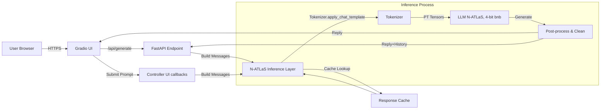

# EduGuide AI – Multilingual Learning & Guidance (Powered by N‑ATLaS)

EduGuide AI is a multilingual learning and guidance assistant built on N‑ATLaS (Nigeria’s national open-source multilingual AI model). It explains topics, guides users, and answers questions in English, Hausa, Yoruba, and Igbo with culturally relevant context. The app runs fully on your infrastructure (Kaggle/Colab/local GPU) with self-hosted inference—no external APIs.

- N‑ATLaS model: https://huggingface.co/NCAIR1/N-ATLaS
- Attribution: “N‑ATLaS is an initiative of the Federal Ministry of Communications, Innovation and Digital Economy, powered by Awarri Technologies.”

---

## Highlights
- Multilingual chat (English, Hausa, Yoruba, Igbo)
- Response level control (Beginner, Intermediate, Advanced)
- Topic presets and Learning‑path friendly UX
- Fast Mode (greedy decoding, token cap) for low latency on T4
- 4‑bit quantization with bitsandbytes for speed and memory efficiency
- Prompt trimming and caching to reduce latency
- Export chat history (JSON)
- Built‑in REST API endpoint: `POST /api/generate`
- Single-file app: `eduguide_ai.py`

---

## Solution Overview
EduGuide AI is a multilingual learning and guidance assistant purpose‑built for Nigeria and Africa. It helps learners understand complex topics with clear, culturally relevant explanations in English, Hausa, Yoruba, and Igbo. The app is fully self‑hosted: it downloads the N‑ATLaS checkpoint from Hugging Face and serves inference locally on GPU (Kaggle/Colab/local). The UX focuses on speed and clarity (Topic Presets, Response Level control, Fast Mode) so users get helpful answers quickly on modest hardware.

Key outcomes:
- Local, privacy‑friendly inference with zero external API dependency.
- Language‑aware, culturally grounded explanations.
- Fast responses on a free T4 GPU using 4‑bit quantization, prompt trimming, and caching.

## Technical Details
- Inference stack: PyTorch + Transformers with `AutoModelForCausalLM` and `AutoTokenizer` (trust_remote_code enabled).
- Quantization: bitsandbytes 4‑bit (nf4 + optional double‑quant) with bfloat16 compute. Graceful fallback to 8‑bit or full precision.
- Memory/latency controls:
  - `device_map="auto"` for efficient placement
  - Prompt trimming to `MAX_INPUT_TOKENS`
  - Response cache keyed by recent turns and generation params
- Generation:
  - Fast Mode reduces temperature and max tokens; greedy decoding path supported
  - Configurable sliders for temperature/top‑p/max tokens
- Runtime accelerations:
  - CUDA TF32 and SDPA attention kernels when available
- Tokenizer robustness:
  - Fast tokenizer first; fallback to slow (sentencepiece) with safe re‑download
  - Output cleaner strips chat‑template markers (`<|end_header_id|>`, etc.)
- Serving:
  - Gradio front‑end + FastAPI backend in one process
  - `/api/generate` endpoint for programmatic access
  - Port conflict retry and Kaggle‑friendly public link behavior

## Quick Start

You can run EduGuide AI on Kaggle (recommended) or Google Colab (free T4 GPU). Both flows self‑host the N‑ATLaS model.

### 1) Kaggle Notebook (GPU + Internet)
1. Create a new Kaggle Python notebook.
2. Turn on GPU and Internet in the right‑hand settings.
3. In the first cell, install dependencies and set safe envs, then restart the kernel after it completes:
```
!pip uninstall -y torchvision torchaudio
!pip install -U --index-url https://download.pytorch.org/whl/cu121 torch==2.5.1
!pip install -U bitsandbytes==0.43.3 transformers==4.46.2 accelerate==0.34.2 sentencepiece==0.1.99 fastapi uvicorn gradio

import os
os.environ["TRANSFORMERS_NO_TORCHVISION"] = "1"
os.environ["TRANSFORMERS_NO_TORCHAO"] = "1"
os.environ["BNB_CUDA_VERSION"] = ""  # let bitsandbytes auto-detect CUDA
```
4. In the second cell, set your Hugging Face token:
```
import os
os.environ["HF_TOKEN"] = "<your_hf_token_here>"
```
5. In the third cell, write the app file:
```
%%writefile eduguide_ai.py
# eduguide's main code
```
6. In the fourth cell, launch the app (Kaggle needs a public link):
```
!python eduguide_ai.py --colab 1
```
7. Open the public Gradio link printed in the output. 

You should see in logs: `Attn q_proj module: Linear4bit` (confirms 4‑bit quantization is active).

### 2) Google Colab (free T4 GPU)
1. New notebook → Runtime: GPU (T4), Python ≥ 3.10.
2. First cell:
```
!pip uninstall -y torchvision torchaudio
!pip install -U --index-url https://download.pytorch.org/whl/cu121 torch==2.5.1
!pip install -U bitsandbytes==0.43.3 transformers==4.46.2 accelerate==0.34.2 sentencepiece==0.1.99 fastapi uvicorn gradio

import os
os.environ["TRANSFORMERS_NO_TORCHVISION"] = "1"
os.environ["TRANSFORMERS_NO_TORCHAO"] = "1"
os.environ["BNB_CUDA_VERSION"] = ""
```
Restart runtime.

3. Second cell:
```
import os
os.environ["HF_TOKEN"] = "<your_hf_token_here>"
```
4. Third cell:
```
%%writefile eduguide_ai.py
# eduguide's main code
```
5. Fourth cell (inline UI in Colab):
```
!python eduguide_ai.py --colab 1 --no-share
```
Or with a public link:
```
!python eduguide_ai.py --colab 1
```

---

## Usage Guide
- Type in English, Hausa, Yoruba, or Igbo; the assistant auto‑detects language.
- Pick a Response Level to control depth.
- Use Topic Presets to quickly start a conversation.
- Enable Fast Mode for low latency (128 tokens, temp 0.2).
- Export history to JSON.

### Performance Tips
- Keep prompts concise; the app trims context to reduce latency.
- Fast Mode defaults: temperature≈0.2, max_new_tokens≈64.
- 4‑bit quantization reduces memory and speeds up inference on T4.

---

## REST API
The UI app also exposes a FastAPI endpoint via Gradio’s server.

- Endpoint: `POST /api/generate`
- Payload (JSON):
```
{
  "prompt": "Your question here",
  "level": "Beginner" | "Intermediate" | "Advanced",
  "history": [
    {"user": "...", "assistant": "..."}
  ],
  "temperature": 0.2,
  "top_p": 0.9,
  "max_new_tokens": 128
}
```
- Response (JSON):
```
{
  "reply": "...",
  "history": [ {"user": "...", "assistant": "..."}, ... ]
}
```

---

## Architecture & Design
- Self‑hosted N‑ATLaS inference using Transformers/PyTorch.
- bitsandbytes 4‑bit quantization where available; fallback to 8‑bit or full precision when needed.
- Prompt trimming and response caching to reduce latency.
- Fast Mode for speed; configurable for quality.
- Gradio front‑end + FastAPI backend in one process.

---

## Technical Architecture



ASCII layout (fallback):

```
 [User Browser]
       |
     HTTPS
       v
   [Gradio UI]  <---->  [FastAPI /api/generate]
       |                        |
  (callbacks)              build messages
       v                        v
  [Controller] ----------> [Inference Layer]
                                 |
                     [Tokenizer -> N‑ATLaS (4‑bit bnb)]
                                 |
                     [Post‑process & Clean Output]
                                 |
                 (reply to UI)  (reply+history to API)
                                 |
                        [Response Cache]
```

Key notes:
- N‑ATLaS runs locally with 4‑bit quantization (bitsandbytes) for latency and memory efficiency.
- Prompt trimming and caching reduce context length and repeat work.
- UI and API share the same inference core to avoid duplication.
- Kaggle uses a public link; local/Colab can use inline or shared URLs.

## Troubleshooting
- "127.0.0.1 refused to connect" (Kaggle): Kaggle cannot access localhost. Always use the public link.
- Tokenizer JSON error: Restart the runtime and re‑run cells; the app already falls back to a slow tokenizer.
- bitsandbytes GPU missing: Ensure Torch CUDA 12.1 build and bitsandbytes 0.43.x. Clear `BNB_CUDA_VERSION`.
- Torch/vision NMS error: Uninstall torchvision/torchaudio; they are not needed and can import custom ops.

---

## Compliance & Attribution
- Self‑hosted inference (no managed API).
- Add visible attribution (already in app footer):
  - “N‑ATLaS is an initiative of the Federal Ministry of Communications, Innovation and Digital Economy, powered by Awarri Technologies.”
- Respect the model license and usage cap (≤1000 active users) unless you secure a commercial license.
- Ethical usage and cultural sensitivity are required.

---

## Screenshots

Below are screenshots demonstrating the app.
- **Home Page**

  

- **Demonstration 1**

  

- **Demonstration 2**

  

- **Chat Export Confirmation**

  

---

## Performance Notes

- 4‑bit confirmation: Look for the log line `Attn q_proj module: Linear4bit` after model load.
- T4 GPU results (typical short prompts): Fast Mode (temperature≈0.2, max_new_tokens≈64–128) returns in a few seconds depending on prompt length.
- Latency controls:
  - Keep prompts concise; app trims to `MAX_INPUT_TOKENS` by default.
  - Use Fast Mode for greedy/short outputs; increase tokens only when needed.
- If bitsandbytes falls back (no GPU bnb), the app still runs at reduced speed.

---

## Security & Tokens
- Don't commit your HF token.
- Set `HF_TOKEN` at runtime (Kaggle/Colab cell or environment variable).

---

## Roadmap (Post‑Challenge)
- Voice I/O (ASR/TTS), analytics dashboard, admin CMS
- Expanded learning paths and community features
- Model routing for improved Yoruba performance
- Containerized deployment (Docker) and CI/CD

---

## Acknowledgments
- Awarri Technologies and Federal Ministry of Communications, Innovation and Digital Economy
- National Centre for Artificial Intelligence and Robotics (NCAIR)
- Nigerian language tech contributors and communities

---

## License
Please review the N‑ATLaS model license on Hugging Face. Public/academic use is permitted with attribution and a ≤1000 active user cap. Commercial or enterprise usage requires a separate license from Awarri Technologies.
